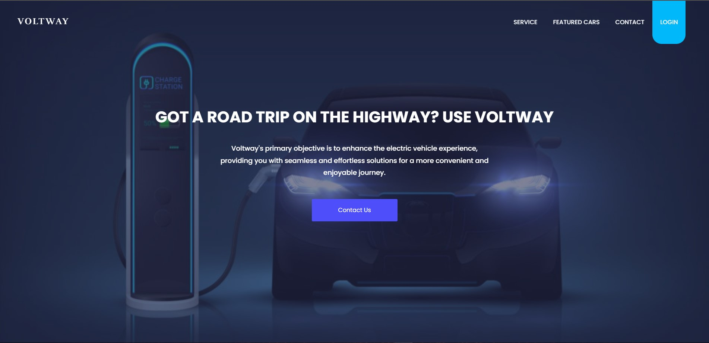

#Voltway

## What is Voltway? 

**Voltway** is a web-based platform that aims to create an easier and more convenient experience to **Electric Vehicle (EV)** users 

## What services does Voltway provides?

**We provide many services including**

1. **Find Charge Points**: *Voltway provides charge points location services which let the stations appear to the customer based on the customer's location with the ability to filter the station based on the plug type of the customer's car*
2. **Maintenance Centers and Tips**: *Voltway suggest the best maintenance centers for yor cars and provides a tips for when to maintain your car Depending on the distance traveled*
3. **Voltie AI**: *meet Voltie our AI friend powered by **OPENAI** ask him anything about your car features, price, manufacture etc.. he will be happy to help*

## How to run Voltway?

1. Install [NodeJS](https://nodejs.org/en) and NPM 
2. In terminal change directory to the folder 
3. Change directory to frontend folder using `cd ./frontend` then run `npm install` to download the necessary packages
4. Change directory to backend folder using `cd ./backend` then run `npm install` to download the necessary packages
5. In `backend` folder run `npx nodemon index.js` in order to run the server
6. Using live server extension in VS code open `index.html` and run through the live server 

## Note

*This code might be outdated or need some fixing it will be refactored soon **Stay Tuned***